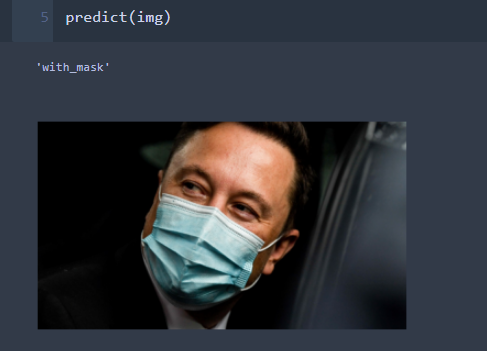
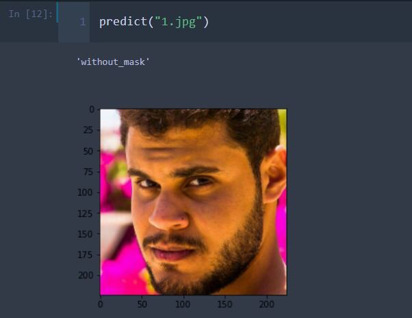

# Mask detection

## Dataset:  
https://www.kaggle.com/omkargurav/face-mask-dataset

## required librares:
- numpy
- pandas
- keras

## model:
- I used ResNet 50 and finetuned it after removing the last sofmax layer
- I added one more layer for two classes ["without_mask","withmask"]
- I used image data generator class in my model with no augmentation specified (I will maybe apply augmentation and see the difference)

## results:
- the best model got an accuracy of 90% accuracy on training set, 93.5% accuracy on the developement set and 91% on the testing set  
- the model has a weak tendency to sky_blue objects such as towels, shirts and what so ever in the presence of a face (further investigation soon isa)  [I will put the unrecognized images in a folder]
- the model has a problem with differing between mask on a face and in picture, partially it would be solved with face recog, but another issue arises which is a face with a mask but the face is not covered by the mask
- the model have the far face wearing mask issue, which also can be solved by using a face recognition before using the model  
- I didn't use the model on real time, but I am looking up to  

A readme update will be uploaded soon isa  
A demo will be uploaded soon  
A realtime implementation will be uploaded soon  
